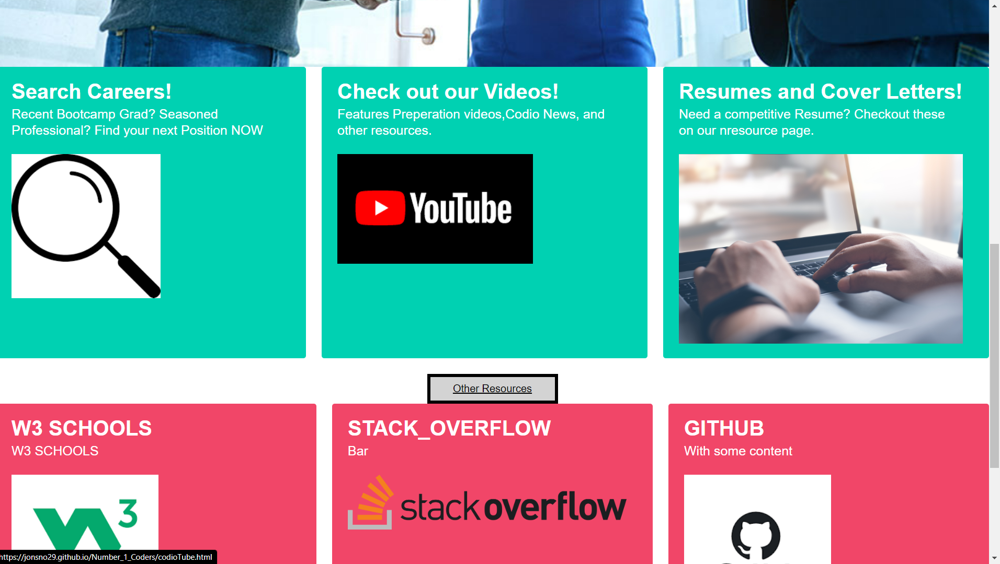
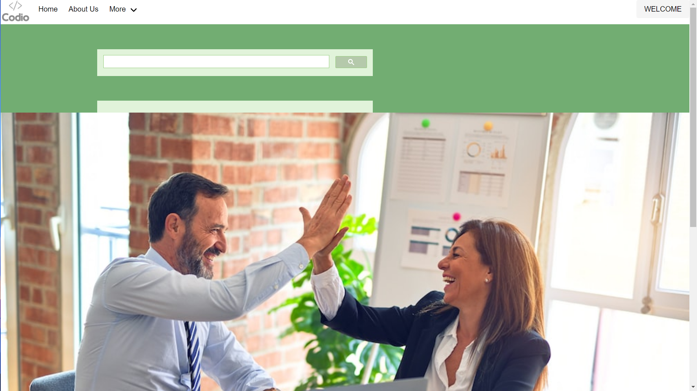
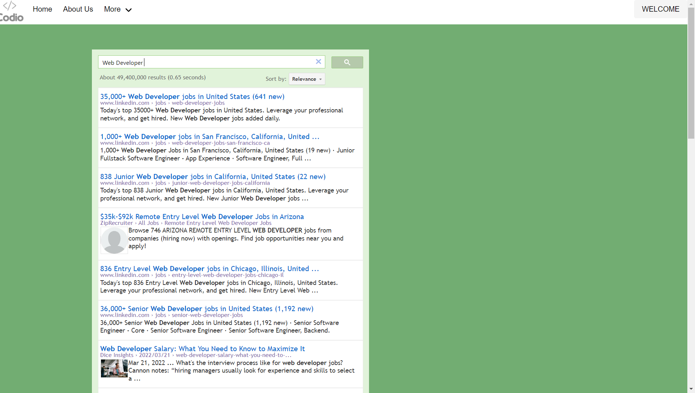
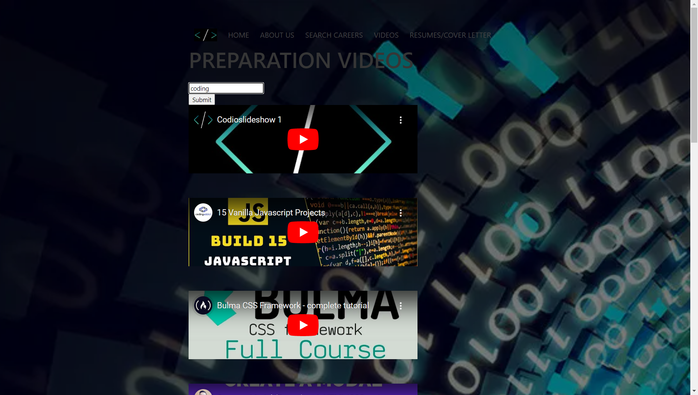

# Number_1_Coders

## OVERVIEW

In this project, our group created an Interactive Front-End Webpage

from the skills we've learned, in the first six weeks of our Coding

Bootcamp.

## USER STORY

AS a coding bootcamp grad, I want to find local coding careers near me

SO, I can get employed upon graduation.

## ACCEPTANCE CRITERIA

GIVEN I am a coding grad, when I enter my city into the search bar

Then, a list of coding related job openings pops up alongside a map

of the area.

## LIVE LINK:

Repository: https://github.com/JonSno29/Number_1_Coders.git

WebPage: https://jonsno29.github.io/Number_1_Coders/

## INSTALLATION, USAGE & MOCK-UP:

1. Once on the deployed link scroll down to the cards.  

2. Scroll down on the landing page and pick the Search Careers box 

3. Once On the Search page, type in your keyword and the results will show up

4. Choose one of the results and it takes you to the direct page.

5. Then go to the more tab in the nav and choose videos. Once there you can search specific videos and watch the embedded videos.

🎗 Google search API

🎗 YouTube iFrame Embebed API

🎗 Powered by jQuery

🎗 Visually appealing

🎗 Uses a GIF to show features

🎗 These features enhance user experience

🎗 JavaScript

🎗 jQuery

🎗 Terminal

🎗 Bulma

🎗 GitHub

🎗 GitHub Pages

🎗 Visual Studio (VS) Code

🎗 HTML

🎗 CSS

🎗 Screencastify for mock-up GIF

## CREDITS:

developers.google.com

Youtube.com for Youtube iFrame Embeded API

Bulma.io

## LICENSE:

MIT LICENSE

## FEATURES:

## HOW TO CONTRIBUTE:

Fork my repositories so I can fork yours:

Use the "scout rule" to help others.

## TESTS:

🎗 Forked Repository.

🎗 Trial and error.

🎗 We each had back up repositories to minimize errors.

## CONTACT: Emails:

🎗 Amanda: amanda_lopez34@yahoo.com

🎗 Jon: snoverjon@gmail.com

🎗 Kenny: huntken26@gmail.com

🎗 Julian: julianj9011@gmail.com
